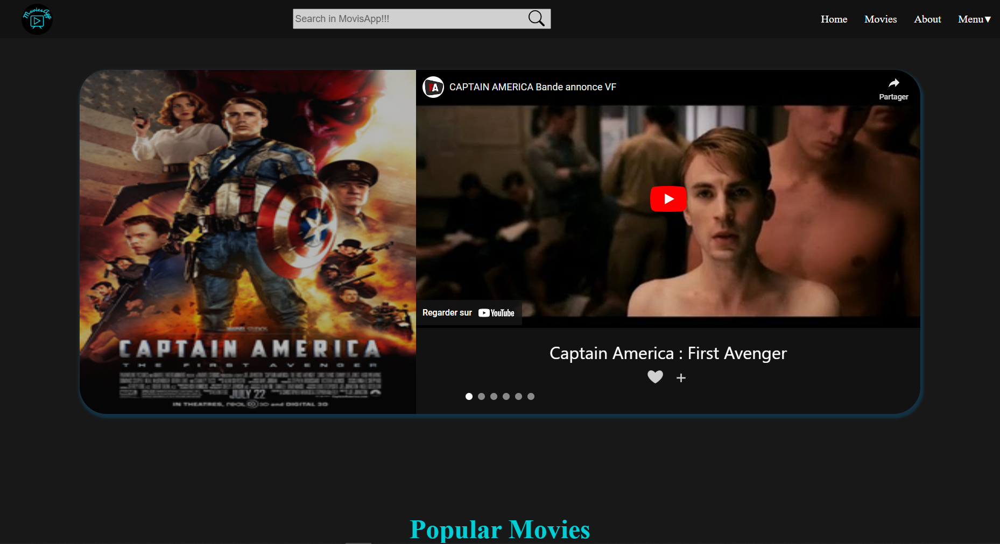
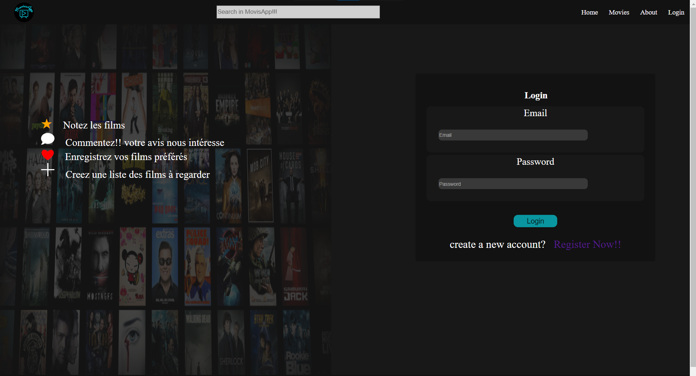
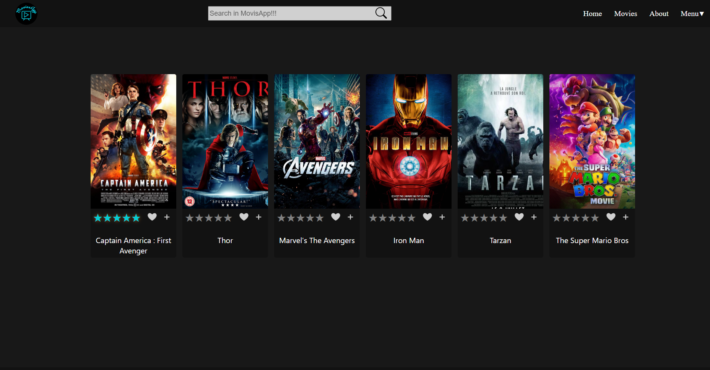
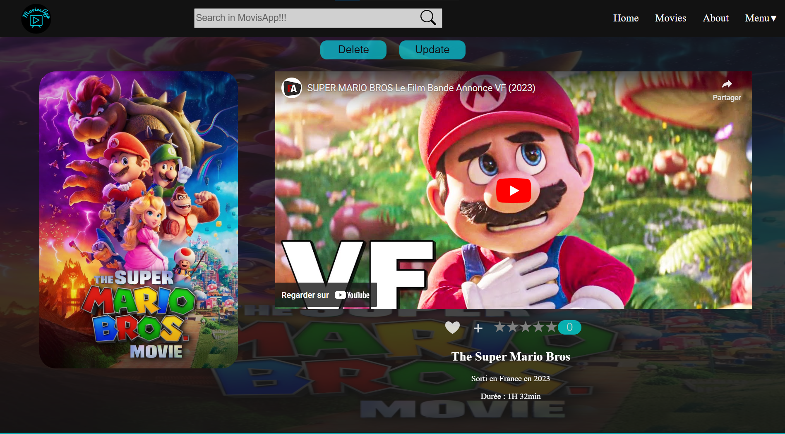
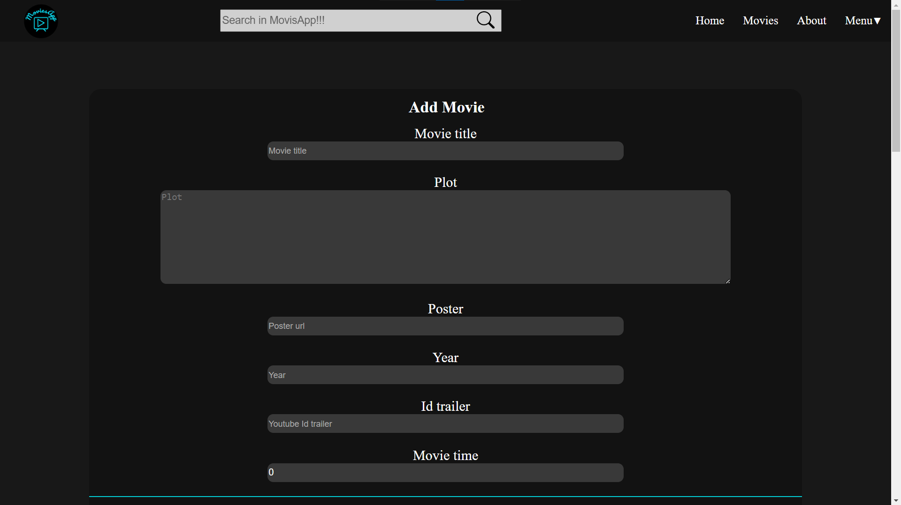
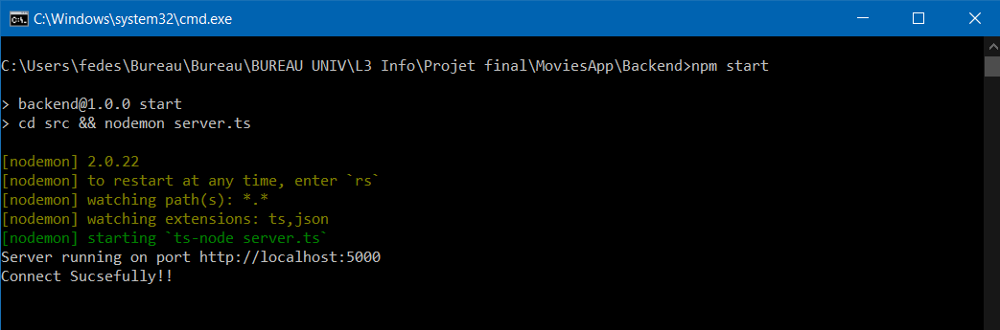
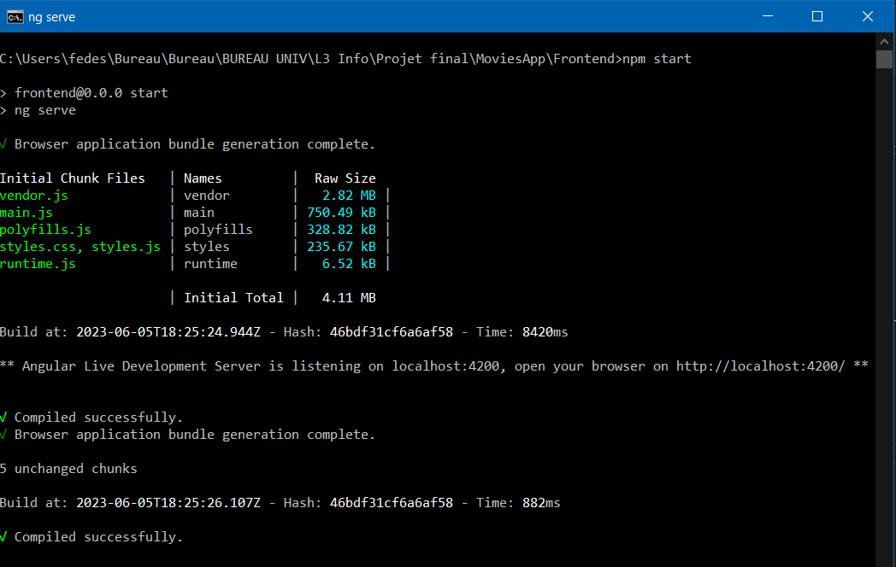

<p align="center">
  <a href="https://moviesapp-ti0s.onrender.com/home" rel="noopener">
 </a>
</p>

<h3 align="center">MoviesApp</h3>

<div align="center">

[]()
[](https://moviesapp-ti0s.onrender.com/home)


</div>

---

<p align="center"> MoviesApp is a website providing film information.
<br> 

</p>


## Live Demo

A live demo is avaible <a href="https://moviesapp-ti0s.onrender.com/home" >here!!</a>

## 📝 Table of Contents

- [About](#about)
- [MovieApp Screenshots](#project)
- [Prerequisites](#prerequisites)
- [Getting Started](#getting_started)
- [Deployment](#deployment)
- [Built Using](#built_using)
- [Authors](#authors)

## 🧐 About <a name = "about"></a>
Final project for my last college year
<br>

## 📸 MovieApp Screenshots<a name = "project"></a>

# Home<br>
<br>
# Login<br>
The passswords are encrypted before being send into the database
<br>
<br>
# Movies<br>
Cards about all the movies in the database<br>
<br>
# OneMovie<br>
The information of a single movie, also we can see the admin's buttons delete & update <br>
<br>
# AddMovie<br>
The form to add a new movie, only can be done by an admin<br>
<br>


## 🏁 Getting Started <a name = "getting_started"></a>
These instructions will get you a copy of the project up and running on your local machine for development and testing purposes.<br> See deployment for notes on how to deploy the project on a live system.

### Prerequisites <a name = "prerequisites"></a>

What things you need to install:
- Create mongoDb database
- install nodejs
- install npm
- install angular-cli

upload MoviesApp project


## 🚀 Deployment <a name = "deployment"></a>

Open two command-line interface (such as Command Prompt or Terminal)

1st one - Backend 
```
cd ~<path>/MoviesApp/Backend
npm install 

```
2nd one - Frontend
```
cd ~<path>/MoviesApp/Frontend
npm install

```
after the installing of npm, you must run the following command on bouth
terminals, in any order.

```
npm start
```
wait utill the loading is finished and if evry ting is ok you shoul see the deploy aplication runing...

Backend shouuld be on port 5000<br>
<br>
Frontend shouuld be on port 4200<br>
<br>

## ⛏️ Built Using <a name = "built_using"></a>

- [MongoDB](https://www.mongodb.com/) - Database
- [Express](https://expressjs.com/) - Server Framework
- [NodeJs](https://nodejs.org/en/) - Server Environment
- [Angular]() - Angular

## ✍️ Authors <a name = "authors"></a>
- [@FedeSCode](https://github.com/FedeSCode) - Idea & Initial work

